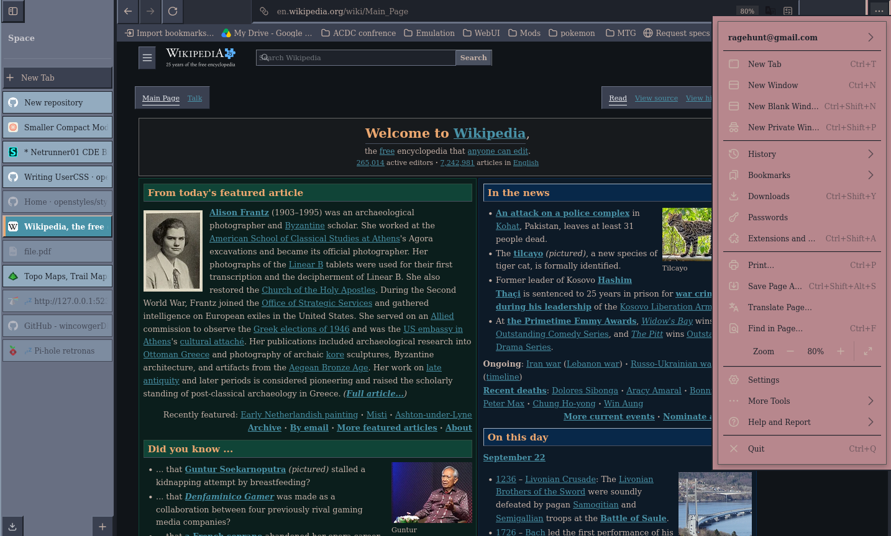

# Dark-Brocia-ZDE
Dark Broica CDE theme for Zen Browser. Vertical tabs  compact mode  userChrome.css

## Preview

## Palette

| Color | Hex | Use |
|---|---|---|
| Putty | `#c6b2a8` | URL bar, text |
| Muted | `#999999` | Secondary text |
| Slate | `#8998aa` | Sidebar |
| Slate-dark | `#686f82` | Titlebar, nav bar |
| Orange | `#eda870` | Hover, accents, active tab stripe |
| Teal | `#4992a7` | Active tab, focus |
| Rose | `#b7878d` | App menu |
| Steel | `#93abbf` | Idle tabs |

Extended darks: `#1e222a`, `#2a2e38`, `#3a4050`, `#4a5160`, `#6a7285`

## Install

1. In Zen, go to `about:support` and click **Open Profile Folder**.
2. Create a folder named `chrome` if it doesn't exist.
3. Copy `userChrome.css` into that `chrome` folder.
4. In `about:config`, set `toolkit.legacyUserProfileCustomizations.stylesheets` to `true`.
5. Restart Zen.

## Notes

- Built and tested on Zen Browser. Not compatible with stock Firefox.
- Designed for compact mode with vertical tabs.
- Pairs well with the Stylus userstyle of the same name for website theming.
  - https://userstyles.world/style/30305

## License

MIT
